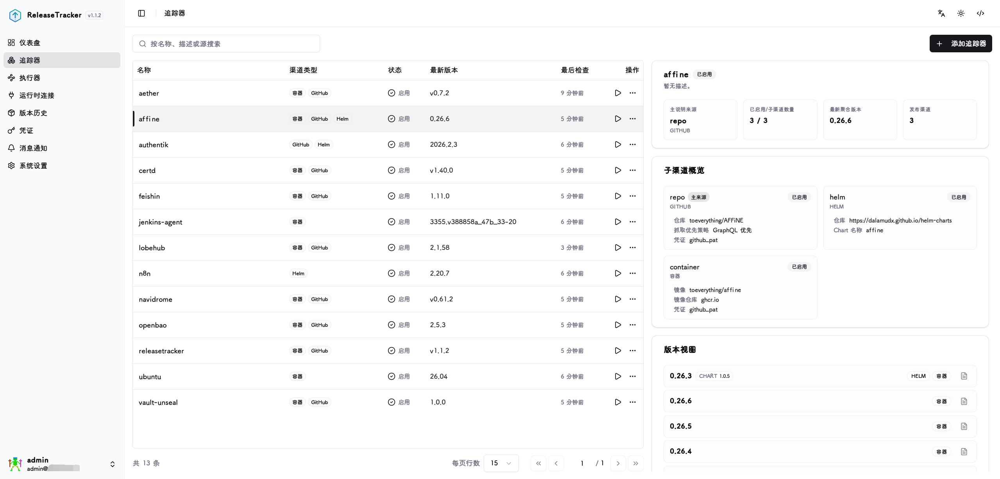
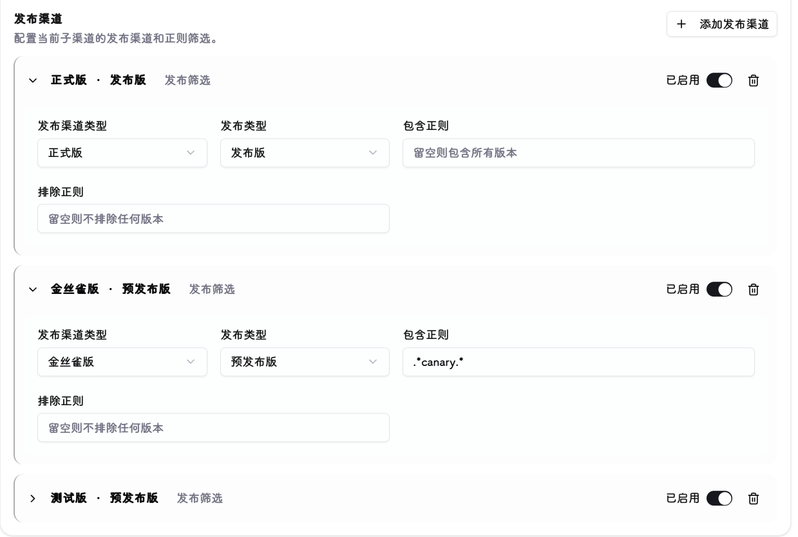
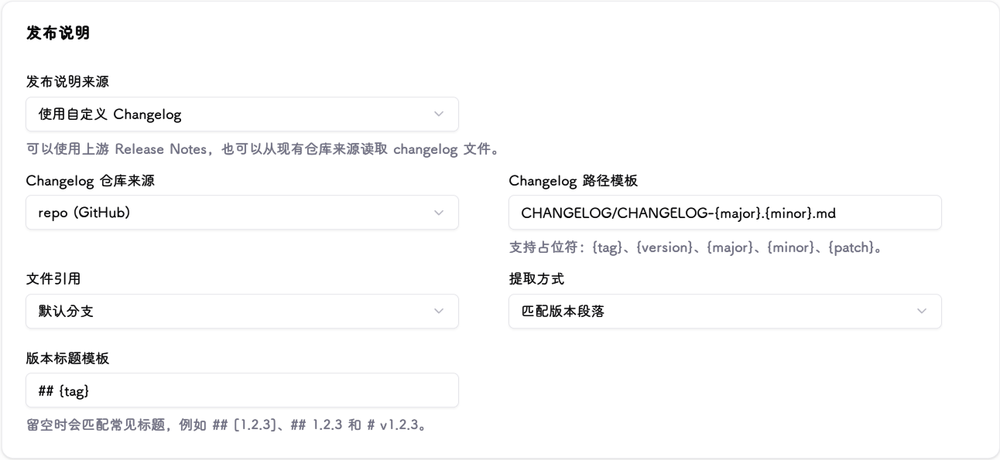
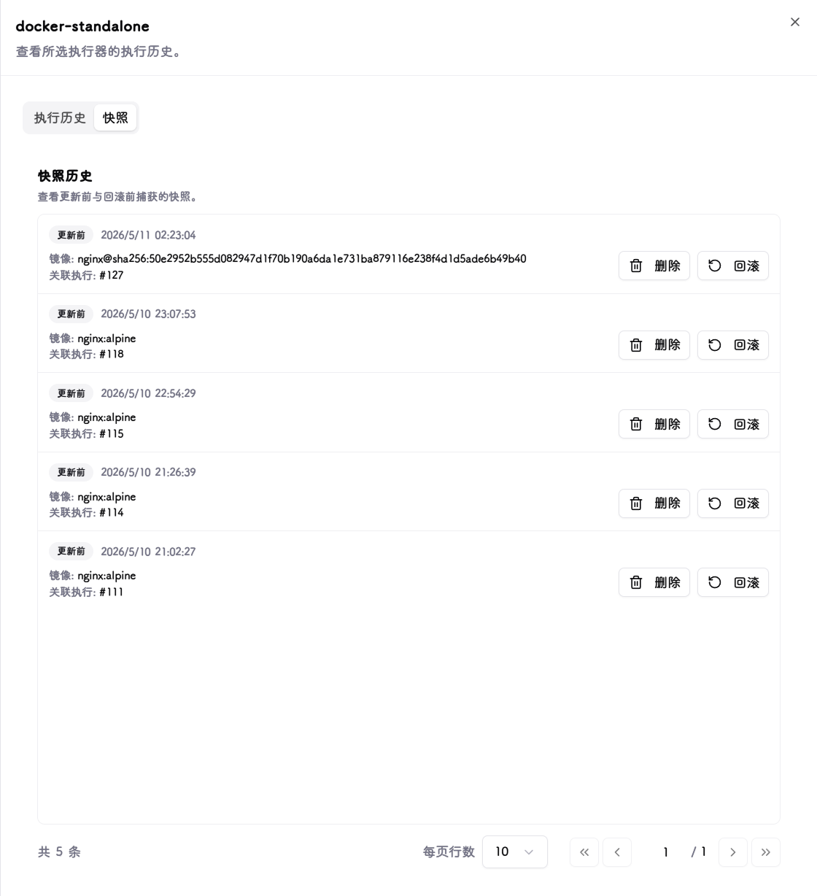
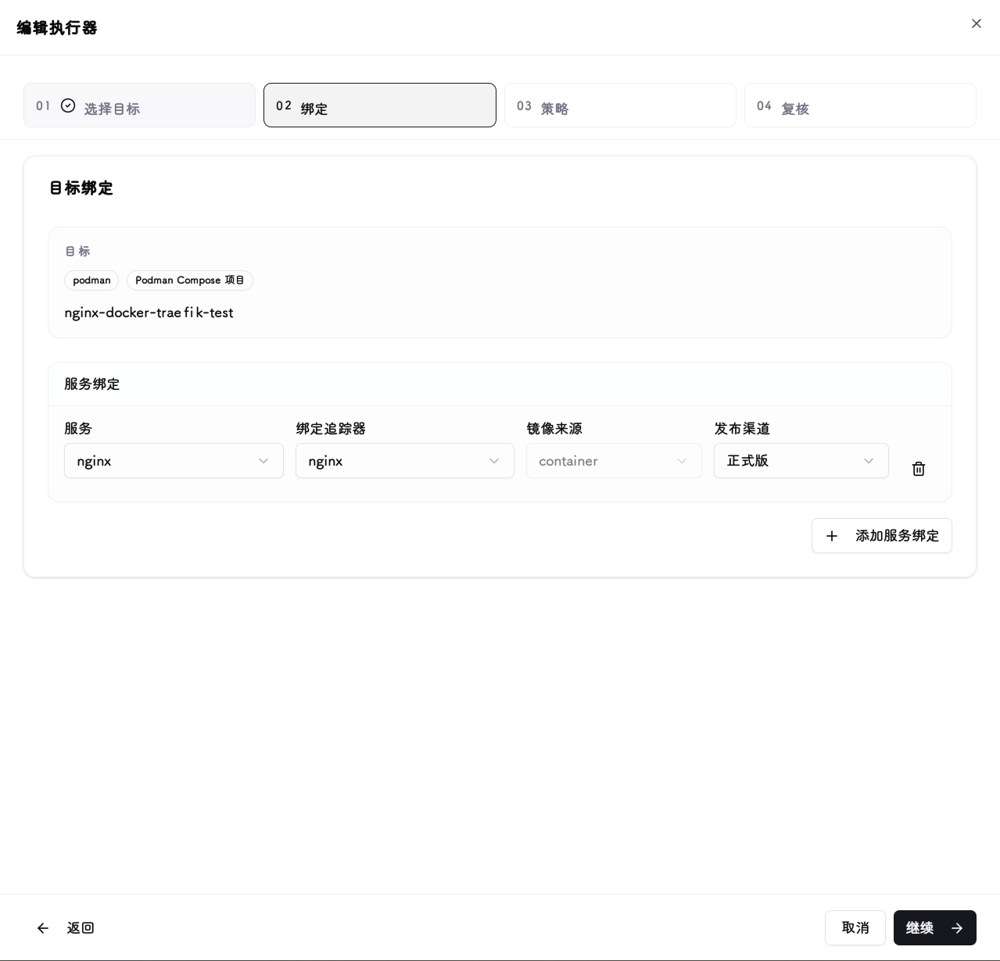
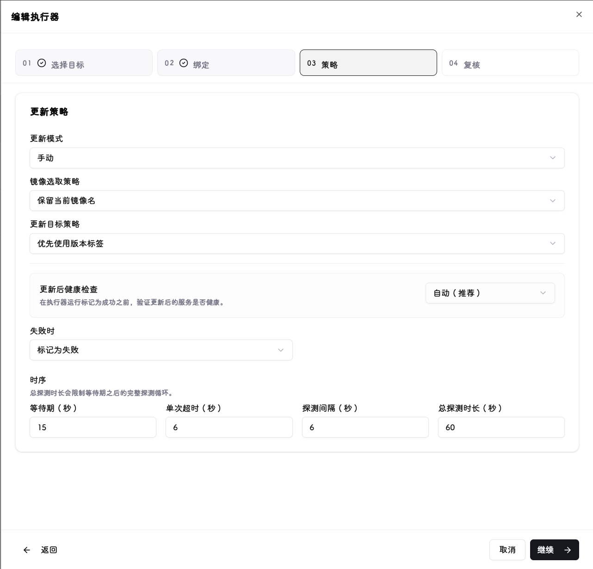
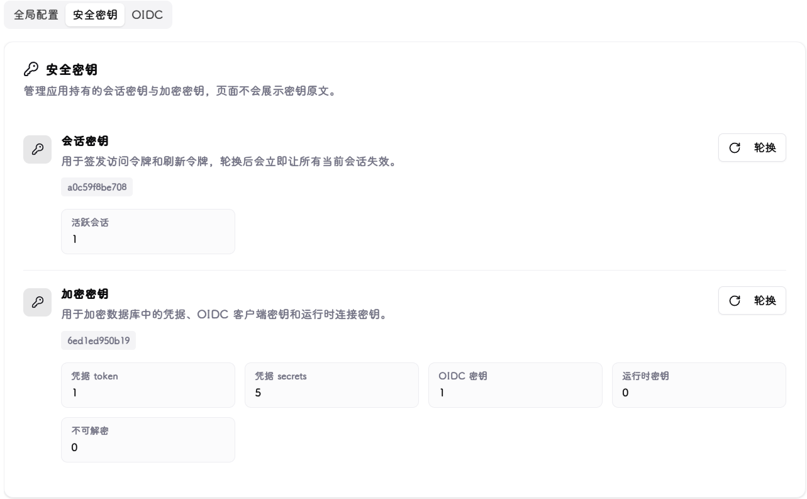

# 功能截图 / Feature Screenshots

## 登录 / Login

## 仪表盘 / Dashboard

系统整体状态与近期版本变化概览。

Overview of system state and recent release activity.

## 追踪器 / Trackers

定义版本来源。支持 GitHub、GitLab、Gitea、Helm Chart、OCI 容器镜像仓库，通过发布渠道规则区分 Stable、Pre-Release、Beta、Canary。

Define release sources. Supports GitHub, GitLab, Gitea, Helm charts, and OCI registries; release channel rules separate Stable, Pre-Release, Beta, and Canary streams.

### 编辑/添加追踪器 / Edit & Add Tracker

## 执行器 / Executors

将追踪器的目标版本绑定到实际运行时目标：Docker 容器、Compose Project、Portainer Stack、Kubernetes Workload、Helm Release。支持手动执行、计划执行、维护窗口、执行历史。

Bind tracker target versions to runtime targets: Docker containers, Compose projects, Portainer stacks, Kubernetes workloads, or Helm releases. Supports manual / scheduled execution, maintenance windows, and run history.

### 编辑/添加执行器 / Edit & Add Executor

## 运行时连接 / Runtime Connections

接入 Docker、Podman、Portainer、Kubernetes 环境。敏感连接信息由凭证模块统一加密管理。

Connect Docker, Podman, Portainer, and Kubernetes environments. Connection secrets are managed and encrypted through the credentials module.

## 版本历史 / Release History

记录追踪器发现过的版本变化（来源、发布渠道、发布时间、版本标识），用于回溯演进和作为执行器的更新依据。

History of discovered versions (source, channel, published time, identity) — used for auditing and as executor update candidates.

## 凭证管理 / Credentials

集中管理 Git 平台 Token、容器镜像仓库账号、运行时连接密钥等敏感信息，入库前加密保存。

Central store for Git tokens, container registry credentials, and runtime connection secrets. Sensitive fields are encrypted before persistence.

## 消息通知 / Notifications

Webhook 通知，支持事件过滤与 Discord / Slack 兼容格式。

Webhook notifications with event filtering and Discord / Slack compatible payloads.

## 系统设置 / System Settings

时区、日志级别、版本历史保留数量、BASE URL、系统密钥与加密密钥轮换、oidc等运行配置，均可在 Web UI 完成，无需环境变量。

Timezone, log level, release history retention, BASE URL, session and encryption key rotation, OIDC — all configurable from the Web UI, no environment variables required.