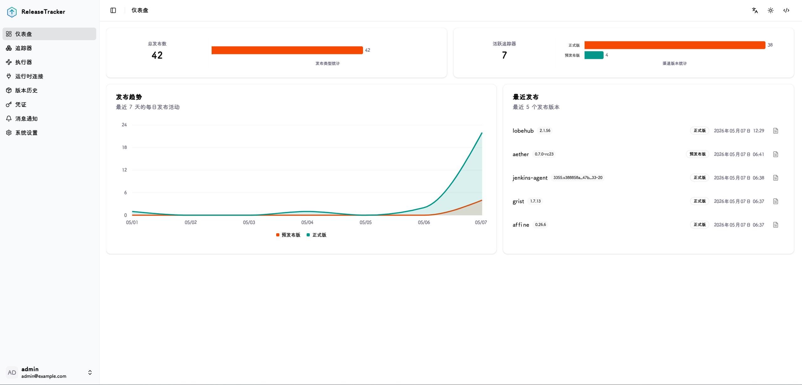
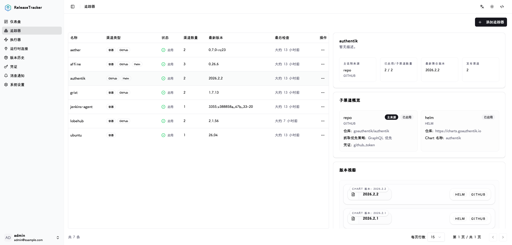
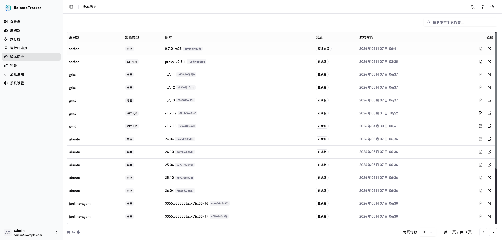
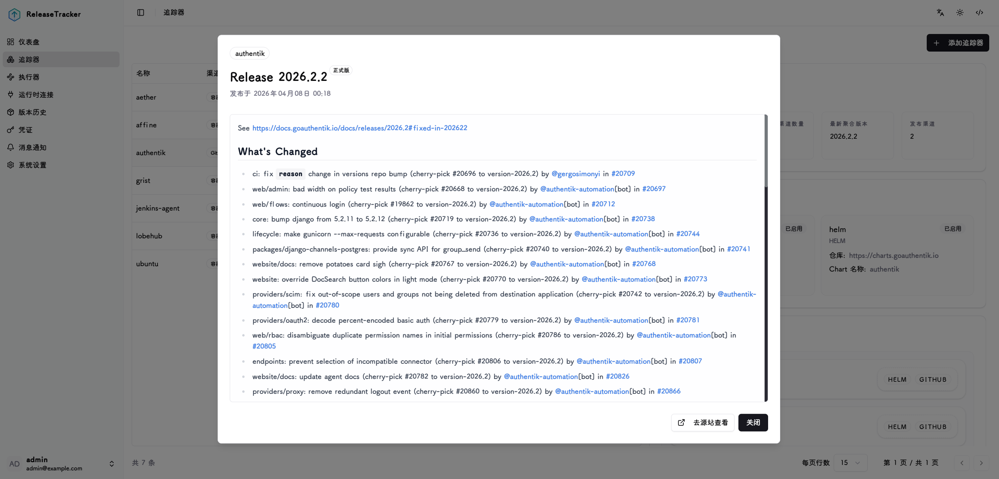
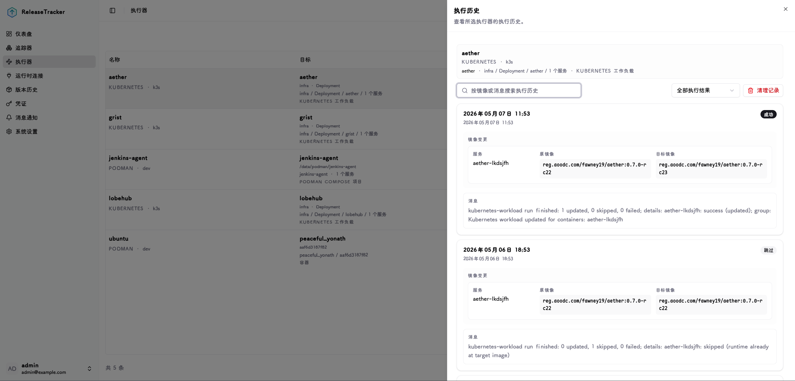

# 功能截图与场景说明 / Feature Screenshots

本文通过界面截图说明 ReleaseTracker 的核心功能模块，帮助你快速了解从版本追踪、运行时连接到执行器更新编排的完整流程。

This document uses UI screenshots to explain the core ReleaseTracker modules, from release tracking and runtime connections to executor-based update orchestration.

## 仪表盘 / Dashboard

仪表盘提供系统整体状态视图，包括近期版本变化等信息。

The dashboard provides an overview of recent release changes.

## 追踪器 / Trackers

追踪器用于定义版本来源。ReleaseTracker 支持 GitHub、GitLab、Gitea、Helm Chart 和 OCI 容器镜像仓库，并允许通过发布渠道规则区分 Stable、Pre-Release、Beta、Canary 等版本流。

Trackers define release sources. ReleaseTracker supports GitHub, GitLab, Gitea, Helm charts, and OCI container registries, with release channel rules for streams such as Stable, Pre-Release, Beta, and Canary.

## 版本历史 / Release History

版本历史记录追踪器发现过的版本变化，并保留来源、发布渠道、发布时间和版本标识等信息。它可以帮助你回溯版本演进过程，也可以作为执行器更新目标的依据。

Release history records discovered version changes with source, channel, published time, and version identity. It helps with auditing release evolution and provides update candidates for executors.

## Release Notes

Release Notes 弹窗展示单个版本的详细发布说明、来源信息和发布渠道。对于 GitHub、GitLab、Gitea 等源码平台，它可以直接展示上游 release notes，便于在执行更新前评估变更内容。

The Release Notes modal shows detailed notes, source information, and release channel metadata for a selected version. For source platforms such as GitHub, GitLab, and Gitea, it can display upstream release notes before an update is executed.

## 执行器 / Executors

执行器将追踪器中的目标版本绑定到实际运行时目标，例如 Docker 容器、Compose Project、Portainer Stack、Kubernetes Workload 或 Helm Release。它支持手动执行、计划执行、维护窗口和执行历史。

Executors bind tracked target versions to actual runtime targets, such as Docker containers, Compose projects, Portainer stacks, Kubernetes workloads, or Helm releases. They support manual execution, scheduled execution, maintenance windows, and execution history.

## 运行时连接 / Runtime Connections

运行时连接用于接入 Docker、Podman、Portainer 和 Kubernetes 环境。执行器通过这些连接发现可更新目标并执行更新操作，连接所需的敏感信息由凭证模块统一管理。

Runtime connections integrate Docker, Podman, Portainer, and Kubernetes environments. Executors use these connections to discover update targets and perform update operations, while sensitive connection data is managed through credentials.

## 凭证管理 / Credentials

凭证模块集中管理 Git 平台 Token、容器镜像仓库账号、运行时连接密钥等敏感信息。敏感字段在写入数据库前会被加密保存。

The credentials module centrally manages Git platform tokens, container registry accounts, runtime connection secrets, and other sensitive values. Secret fields are encrypted before being persisted.

## 系统设置 / System Settings

系统设置用于管理运行时配置，例如时区、日志级别、版本历史保留数量、BASE URL、系统密钥轮换和加密密钥轮换。大部分运行配置都可以通过 Web UI 完成，无需修改环境变量。

System Settings manage runtime configuration such as timezone, log level, release history retention, BASE URL, session key rotation, and encryption key rotation. Most runtime configuration can be completed from the Web UI without editing environment variables.

## 推荐使用流程 / Recommended Workflow

1. 在凭证管理中添加 Git、镜像仓库、运行时或 OIDC 所需凭证。
2. 在运行时连接中接入 Docker、Podman、Portainer 或 Kubernetes 环境。
3. 创建追踪器并配置版本来源和发布渠道规则。
4. 使用执行器发现运行时目标，并绑定对应追踪器和发布渠道。
5. 在追踪器和版本历史中观察版本变化。
6. 查看 Release Notes 后，手动或按计划执行更新。

1. Add Git, registry, runtime, or OIDC credentials in Credentials.
2. Connect Docker, Podman, Portainer, or Kubernetes environments in Runtime Connections.
3. Create trackers and configure release sources and channel rules.
4. Discover runtime targets with executors and bind them to trackers and release channels.
5. Monitor version changes from the Trackers and Release History.
6. Review Release Notes, then execute updates manually or on schedule.
