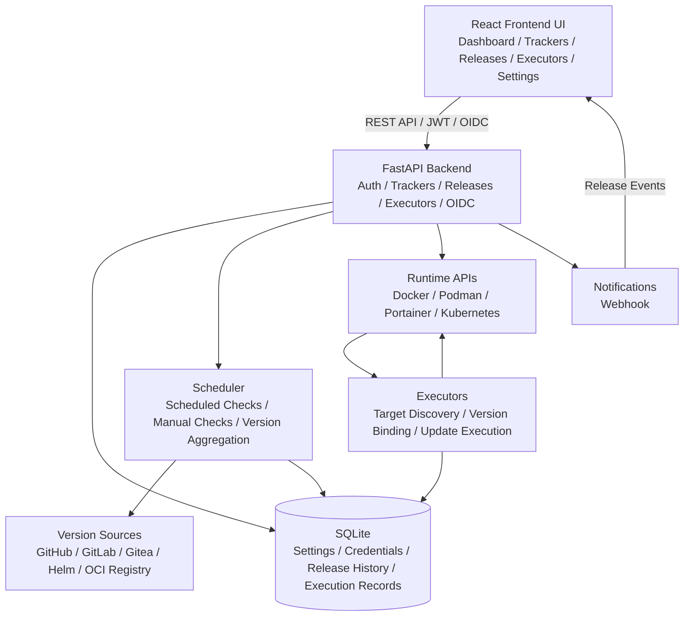

<div align="center">
  
</div>

# ReleaseTracker

[中文](README.md) | [English](README.en.md)

ReleaseTracker is a lightweight, configurable release tracking and update orchestration tool. It tracks releases and tags from GitHub, GitLab, Gitea, Helm charts, and OCI container registries, and maps version changes to runtime targets such as Docker, Podman, Portainer, Kubernetes, and Helm.


## Features

- **Multi-source tracking**: GitHub, GitLab (incl. self-hosted), Gitea, Helm charts, Docker Hub, GHCR, private OCI registries.
- **Aggregate trackers**: bind multiple sources under one tracker; filter, merge, and display via release channel rules.
- **History + current projection**: keep full release history while maintaining the latest installable version view.
- **Runtime connections**: Docker, Podman, Portainer, Kubernetes; secrets centrally managed and encrypted.
- **Executor orchestration**: target discovery, binding, manual / scheduled execution, maintenance windows, and run history for containers, Compose projects, Portainer stacks, Kubernetes workloads, and Helm releases.
- **Snapshot & rollback**: pre-update snapshots with rollback and health-check-driven recovery.
- **Security**: local users + JWT + OIDC; sensitive data encrypted with Fernet; rotatable system keys.
- **System settings**: timezone, log level, history retention, BASE URL, key rotation — all from the Web UI.
- **Notifications**: webhook with event filtering, bilingual messages, and Discord / Slack compatible fields.
- **Modern frontend**: React 19 + TypeScript + TailwindCSS, bilingual (zh/en), dark mode, responsive layout.

## Feature Screenshots

See [FEATURES.md](FEATURES.md) for UI screenshots and walkthroughs.

## Architecture



In production, FastAPI serves the built frontend and the API from a single process. In development, Vite runs the dev server and proxies `/api` to the backend.

## Quick Start

### Requirements

- Python 3.12+
- Node.js 20+
- npm
- uv

### Development

```bash
git clone https://github.com/dalamudx/ReleaseTracker.git
cd ReleaseTracker

make install
make dev
```

After the development servers start, open:

- Frontend: http://localhost:5173
- Backend API: http://localhost:8000
- Swagger UI / ReDoc: http://localhost:8000/docs, http://localhost:8000/redoc

### Docker Deployment

```bash
docker run -d \
  --name releasetracker \
  -p 8000:8000 \
  -v $(pwd)/data:/app/backend/data \
  ghcr.io/dalamudx/releasetracker:latest migrate-and-serve
```

Open http://localhost:8000. The first launch creates the default administrator `admin` / `admin` — **change the password immediately** after logging in.

### Docker Compose

```yaml
services:
  releasetracker:
    image: ghcr.io/dalamudx/releasetracker:latest
    container_name: releasetracker
    ports:
      - "8000:8000"
    volumes:
      - ./data:/app/backend/data
    restart: unless-stopped
    command: migrate-and-serve
```

Start the service:

```bash
docker compose up -d
```

## Configuration

Runtime configuration (timezone, log level, release history retention, BASE URL, key rotation, etc.) is managed from the System Settings page — no `.env` files or environment variables required.

### BASE URL / Reverse Proxy

The BASE URL is the public address browsers use to reach ReleaseTracker. It drives reverse-proxy deployments and OIDC callback generation. Set it in `System Settings → Global Settings → BASE URL`, for example `https://releases.example.com` or, under a sub-path, `https://example.com/releasetracker`. Sub-path deployments must include the full sub-path.

OIDC callbacks resolve to:

```text
{BASE URL}/auth/oidc/{provider}/callback
```

### Data Directory and System Keys

The container data directory defaults to `/app/backend/data`. Mount a persistent directory when deploying:

```bash
-v $(pwd)/data:/app/backend/data
```

On first startup, ReleaseTracker creates `system-secrets.json` holding the JWT signing key and the Fernet encryption key. Both can be rotated from System Settings; encryption key rotation re-encrypts existing data and is blocked when any row cannot be decrypted with the current key.

### Database Migrations

The SQLite schema is managed by dbmate. Docker entrypoint commands:

| Command | Description |
|------|------|
| `serve` | Start the app without running migrations |
| `migrate` | Run migrations only |
| `migrate-and-serve` | Run migrations, then start the app |

For local development: `make dbmate-migrate`.

## Development Commands

Common: `make install`, `make dev`, `make lint`, `make build`, `make version VERSION=x.y.z`. Run `make help` for the full list.

Tests:

```bash
uv --directory backend run pytest -q     # Backend
npm --prefix frontend run test           # Frontend
```

## Roadmap

- [x] Executor runtime update reliability
- [x] Add executor snapshot and recovery features
- [x] Add post-update health check features
- [ ] Add customizable CHANGELOG support
- [ ] Add more notification channels

## License

GPL-3.0 License
