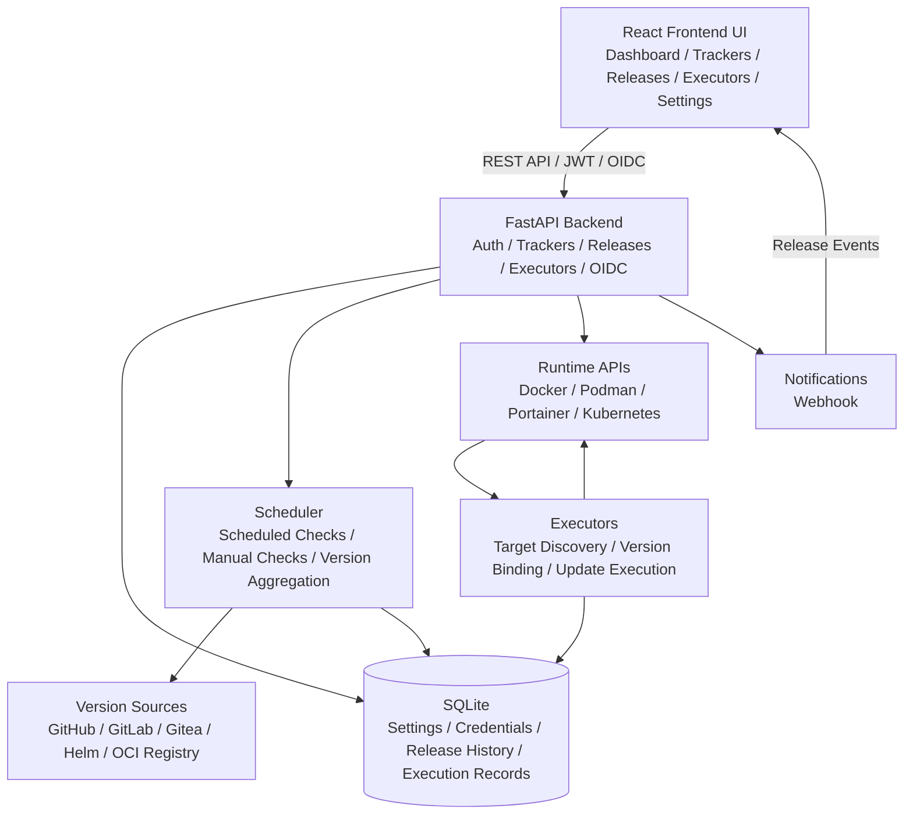

<div align="center">
  
</div>

# ReleaseTracker

[中文](README.md) | [English](README.en.md)

ReleaseTracker is a lightweight, configurable release tracking and update orchestration tool. It tracks releases and tags from GitHub, GitLab, Gitea, Helm charts, and OCI container registries, then maps version changes to runtime targets such as Docker, Podman, Portainer, Kubernetes, and Helm.


## Features

- **Multi-source release tracking**: supports GitHub, GitLab including self-hosted instances, Gitea, Helm charts, Docker Hub, GHCR, and private OCI registries.
- **Aggregate trackers**: bind multiple version sources to one tracker, then filter, merge, and display versions through release channel rules.
- **Version history and current projection**: keeps historical release records while maintaining the latest executable update view.
- **Runtime connections**: supports Docker, Podman, Portainer, and Kubernetes connections, with credentials managed centrally.
- **Executor orchestration**: supports target discovery, binding, manual execution, scheduled execution, maintenance windows, and execution history for containers, Compose projects, Portainer stacks, Kubernetes workloads, and Helm releases.
- **Secure authentication**: supports local users, JWT sessions, OIDC login, password updates, and session refresh.
- **Credential encryption**: tokens, OIDC client secrets, runtime connection secrets, and other sensitive values are encrypted with Fernet before being persisted.
- **System settings**: timezone, log level, release history retention, BASE URL, and system key rotation are managed from the Web UI.
- **Notifications**: currently supports webhook notifications with selectable events, test sending, Chinese and English messages, and Discord / Slack compatible fields.
- **Modern frontend**: React 19 + TypeScript + TailwindCSS with Chinese / English language support, dark mode, theme colors, and responsive layouts.

## Feature Screenshots

For more UI screenshots and feature walkthroughs, see [Feature Screenshots](FEATURES.md).

## Architecture



In production, FastAPI serves the built frontend assets and the API from the same process. In development, Vite runs the frontend dev server and proxies `/api` requests to the backend.

## Quick Start

### Requirements

- Python 3.10+
- Node.js 20+
- npm
- uv

### Development

```bash
git clone https://github.com/dalamudx/ReleaseTracker.git
cd ReleaseTracker

make install
make dev
```

After the development servers start, open:

- Frontend: http://localhost:5173
- Backend API: http://localhost:8000
- Swagger UI: http://localhost:8000/docs

### Docker Deployment

```bash
docker run -d \
  --name releasetracker \
  -p 8000:8000 \
  -v $(pwd)/data:/app/backend/data \
  ghcr.io/dalamudx/releasetracker:latest migrate-and-serve
```

The production image serves both frontend static files and the API through FastAPI on port `8000`. Open http://localhost:8000 to use the application.

On first startup, ReleaseTracker creates the default administrator account:

- Username: `admin`
- Password: `admin`

Change the default password immediately after logging in.

### Docker Compose

```yaml
services:
  releasetracker:
    image: ghcr.io/dalamudx/releasetracker:latest
    container_name: releasetracker
    ports:
      - "8000:8000"
    volumes:
      - ./data:/app/backend/data
    restart: unless-stopped
    command: migrate-and-serve
```

Start the service:

```bash
docker compose up -d
```

## Configuration

### Web UI Settings

The following runtime settings are managed from the System Settings page, not through `.env` files or environment variables:

- Timezone
- Log level
- Release history retention count
- BASE URL
- Session key rotation
- Encryption key rotation

### BASE URL / Reverse Proxy

The BASE URL is the public address used by browsers to access ReleaseTracker. It is used for reverse proxy deployments, OIDC callback URL generation, and post-login OIDC redirects.

Configuration path: `System Settings -> Global Settings -> BASE URL`

Examples:

- `https://releases.example.com`
- `https://example.com/releasetracker`

If the application is deployed under a sub-path, the BASE URL must include the full sub-path. After configuration, OIDC callbacks use:

```text
{BASE URL}/auth/oidc/{provider}/callback
```

### Data Directory and System Keys

The default data directory inside the container is `/app/backend/data`. Mount a persistent directory when deploying:

```bash
-v $(pwd)/data:/app/backend/data
```

On first startup, ReleaseTracker creates `system-secrets.json` in the data directory. It stores:

- Session key: JWT signing key
- Encryption key: Fernet data encryption key

Use the key rotation tools in System Settings if you need to rotate keys. Encryption key rotation re-encrypts existing encrypted data. If any existing data cannot be decrypted with the current key, rotation is blocked until the data is fixed.

### Database Migrations

The SQLite schema is managed by dbmate. The Docker image supports these entrypoint commands:

| Command | Description |
|------|------|
| `serve` | Start the application without running migrations |
| `migrate` | Run database migrations only |
| `migrate-and-serve` | Run migrations first, then start the application |

For local development:

```bash
make dbmate-migrate
```

## Development Commands

| Command | Description |
|------|------|
| `make install` | Install backend and frontend dependencies |
| `make dev` | Start backend and frontend development servers together |
| `make run-backend` | Start only the backend service |
| `make run-frontend` | Start only the frontend service |
| `make lint` | Run backend and frontend code checks |
| `make format` | Format backend code |
| `make build` | Build frontend production assets |
| `make version VERSION=1.0.1` | Synchronize the root version file, backend version, and frontend version |
| `make dbmate-migrate` | Run dbmate migrations against the current database |
| `make clean` | Clean build artifacts and caches |

## Testing and Build Verification

Backend tests:

```bash
uv --directory backend run pytest -q
```

Frontend build:

```bash
npm --prefix frontend run build
```

## API Documentation

After starting the backend, open:

- Swagger UI: http://localhost:8000/docs
- ReDoc: http://localhost:8000/redoc

## Roadmap

- [ ] Add executor snapshots and recovery
- [ ] Add post-update health checks
- [ ] Add more notification channels

## License

GPL-3.0 License
