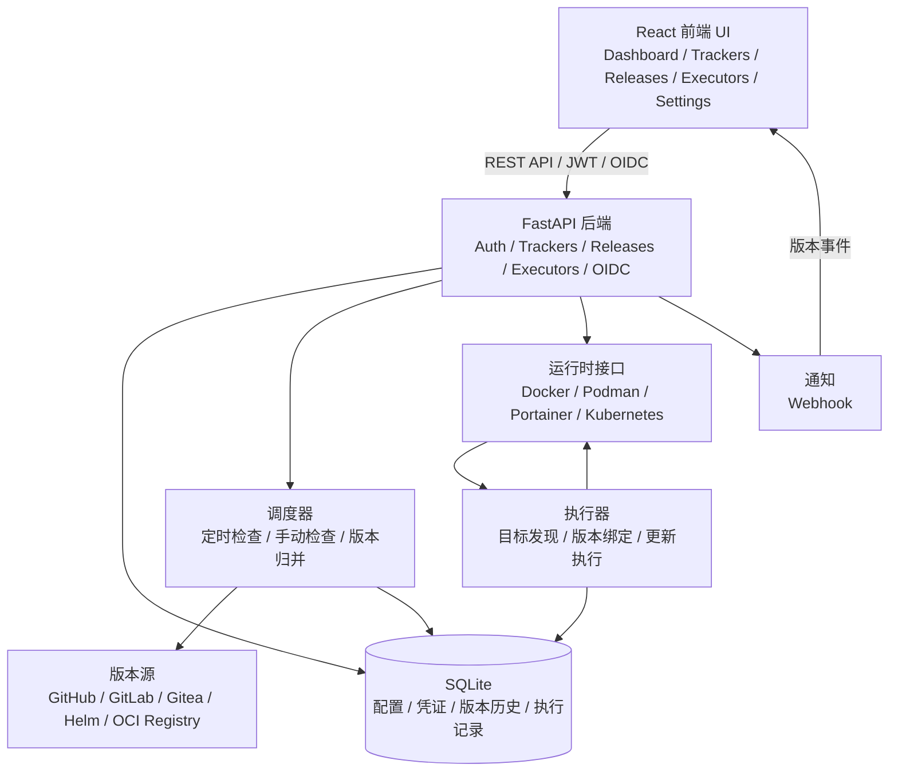

<div align="center">
  
</div>

# ReleaseTracker

[中文](README.md) | [English](README.en.md)

ReleaseTracker 是一款轻量级、可配置的版本追踪与更新编排工具。它追踪 GitHub、GitLab、Gitea、Helm Chart 与 OCI 容器镜像仓库的 release / tag，并帮助将选定版本应用到 Docker、Podman、Portainer、Kubernetes、Helm 等受支持的运行时目标。


## 功能特性

- **多源版本追踪**：GitHub、GitLab（含自托管）、Gitea、Helm Chart、Docker Hub、GHCR、私有 OCI Registry。
- **聚合追踪器**：一个追踪器绑定多个版本源，按发布渠道规则筛选、归并与展示。
- **版本历史与当前投影**：保留历史版本的同时，维护可执行更新的最新版本视图。
- **运行时连接**：接入 Docker、Podman、Portainer、Kubernetes，凭证统一加密管理。
- **执行器编排**：Docker / Podman 容器与 Compose 项目、Portainer Stack、Kubernetes Workload、Helm Release 的目标发现、绑定、手动 / 定时执行、维护窗口与执行历史。
- **运行时更新**：Docker / Podman 单容器与 Compose 分组更新会基于已检查到的配置重建目标；Portainer Stack、Kubernetes Workload、Helm Release 通过对应平台的控制面、声明式状态或 Helm release 历史更新，ReleaseTracker 不声明为这些目标管理完整快照。
- **快照与手动回滚**：具备破坏性重建路径的 Docker / Podman 更新会捕获完整配置快照，操作员可通过 UI 或 API 手动回滚；快照历史支持回滚，并可在功能可用处删除。
- **健康检查**：自动运行时原生检查与手动配置的 HTTP / TCP 探针均有时间边界；失败会记录给操作员处理，不会触发自动回滚，也不声明 Kubernetes / Portainer / Helm 一定具备主机端口探测能力。
- **安全**：本地用户 + JWT + OIDC；敏感数据 Fernet 加密；系统密钥可轮换。
- **系统设置**：时区、日志级别、版本历史保留、BASE URL、密钥轮换等均可在 Web UI 配置。
- **通知**：Webhook 通知，可按事件过滤，提供中英文消息与 Discord / Slack 兼容字段。
- **现代前端**：React 19 + TypeScript + TailwindCSS，中英文、深色模式、响应式。

## 功能截图

界面截图与场景说明见 [FEATURES.md](FEATURES.md)。

## 架构概览



生产部署下，FastAPI 在同一进程中托管前端静态资源与 API；开发模式下，Vite 作为前端 dev server 并将 `/api` 代理到后端。

## 快速开始

### 前置要求

- Python 3.12+
- Node.js 20+
- npm
- uv

### 开发环境

```bash
git clone https://github.com/dalamudx/ReleaseTracker.git
cd ReleaseTracker

make install
make dev
```

开发服务启动后访问：

- 前端：http://localhost:5173
- 后端 API：http://localhost:8000
- Swagger UI / ReDoc：http://localhost:8000/docs、http://localhost:8000/redoc

### Docker 部署

```bash
docker run -d \
  --name releasetracker \
  -p 8000:8000 \
  -v $(pwd)/data:/app/backend/data \
  ghcr.io/dalamudx/releasetracker:latest migrate-and-serve
```

访问 http://localhost:8000 即可使用。首次启动会自动创建默认管理员 `admin` / `admin`，**请立即修改密码**。

### Docker Compose

```yaml
services:
  releasetracker:
    image: ghcr.io/dalamudx/releasetracker:latest
    container_name: releasetracker
    ports:
      - "8000:8000"
    volumes:
      - ./data:/app/backend/data
    restart: unless-stopped
    command: migrate-and-serve
```

启动：

```bash
docker compose up -d
```

## 配置说明

运行时配置（时区、日志级别、版本历史保留、BASE URL、密钥轮换等）全部通过「系统设置」页面管理，无需 `.env` 或环境变量。

### BASE URL / 反向代理

BASE URL 是浏览器访问 ReleaseTracker 的公开地址，用于反向代理部署以及 OIDC callback 生成。在「系统设置 → 全局配置 → BASE URL」配置，例如 `https://releases.example.com` 或带子路径的 `https://example.com/releasetracker`。子路径部署时 BASE URL 必须包含完整子路径。

OIDC callback 将使用：

```text
{BASE URL}/auth/oidc/{provider}/callback
```

### 数据目录与系统密钥

默认数据目录为容器内 `/app/backend/data`，部署时务必挂载持久化目录：

```bash
-v $(pwd)/data:/app/backend/data
```

首次启动会在数据目录生成 `system-secrets.json`，保存 JWT 签名密钥与 Fernet 加密密钥。通过系统设置页面可以轮换；加密密钥轮换会重新加密现有数据，若存在无法解密的数据则会阻止轮换。

### 数据库迁移

SQLite schema 由 dbmate 管理，Docker 镜像入口命令：

| 命令 | 说明 |
|------|------|
| `serve` | 启动应用，不执行迁移 |
| `migrate` | 仅执行数据库迁移 |
| `migrate-and-serve` | 先迁移后启动 |

本地开发：`make dbmate-migrate`。

## 开发命令

常用：`make install`、`make dev`、`make lint`、`make build`、`make version VERSION=x.y.z`。版本目标会同步前后端版本元数据并刷新 `backend/uv.lock`。完整列表运行 `make help`。

测试：

```bash
uv --directory backend run pytest -q     # 后端
npm --prefix frontend run test           # 前端
```

## 路线图

- [x] 执行器运行时更新可靠性
- [x] 为 Docker / Podman 破坏性更新增加执行器快照与手动回滚
- [x] 增加有时间边界、不会自动回滚的更新后健康检查
- [x] 支持 CHANGELOG 自定义功能
- [ ] 更多通知渠道

## 许可证

GPL-3.0 License
