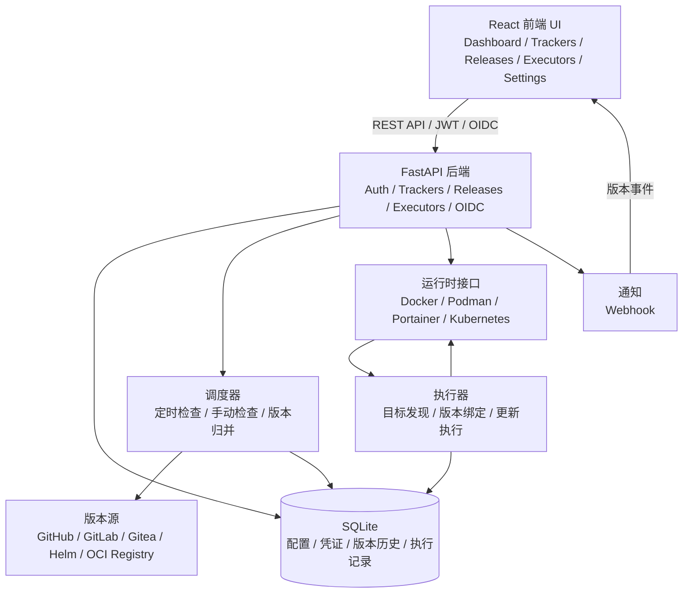

<div align="center">
  
</div>

# ReleaseTracker

ReleaseTracker 是一款轻量级、可配置的版本追踪与更新编排工具，用于追踪 GitHub、GitLab、Gitea、Helm Chart 与 OCI 容器镜像仓库中的 release / tag，并将版本变化关联到 Docker、Podman、Portainer、Kubernetes、Helm 等运行时目标。


## 功能特性

- **多源版本追踪**：支持 GitHub、GitLab（含自托管）、Gitea、Helm Chart、Docker Hub、GHCR 与私有 OCI Registry。
- **聚合追踪器**：一个追踪器可绑定多个版本源，并通过发布渠道规则筛选、归并和展示版本。
- **版本历史与当前投影**：保留历史版本记录，同时维护当前可执行更新的最新版本视图。
- **运行时连接**：支持 Docker、Podman、Portainer 与 Kubernetes 连接，鉴权材料由凭证统一管理。
- **执行器更新编排**：支持容器、Compose Project、Portainer Stack、Kubernetes Workload 与 Helm Release 目标发现、绑定、手动执行、定时执行、维护窗口和执行历史。
- **安全认证**：支持本地用户认证、JWT 会话、OIDC 登录、密码修改和会话刷新。
- **凭证加密**：Token、OIDC 客户端密钥、运行时连接密钥等敏感数据写入数据库前会使用 Fernet 加密。
- **系统设置**：时区、日志级别、版本历史保留数量、BASE URL、系统密钥轮换等配置均通过 Web UI 管理。
- **通知推送**：当前支持 Webhook 通知，可选择事件、测试发送，并提供中文 / 英文消息以及 Discord / Slack 兼容字段。
- **现代化前端**：React 19 + TypeScript + TailwindCSS，支持中英文、深色模式、主题色和响应式布局。

## 架构概览



生产环境下，前端构建产物由 FastAPI 统一托管；开发环境下，Vite 负责前端开发服务器，并将 `/api` 请求代理到后端。

## 快速开始

### 前置要求

- Python 3.10+
- Node.js 20+
- npm
- uv

### 开发环境

```bash
git clone https://github.com/dalamudx/ReleaseTracker.git
cd ReleaseTracker

make install
make dev
```

开发服务启动后访问：

- 前端：http://localhost:5173
- 后端 API：http://localhost:8000
- Swagger UI：http://localhost:8000/docs

### Docker 部署

```bash
docker run -d \
  --name releasetracker \
  -p 8000:8000 \
  -v $(pwd)/data:/app/backend/data \
  ghcr.io/dalamudx/releasetracker:latest migrate-and-serve
```

生产镜像由 FastAPI 在 `8000` 端口统一托管前端静态文件和 API。访问 http://localhost:8000 即可使用。

首次启动会自动创建默认管理员账户：

- 用户名：`admin`
- 密码：`admin`

请登录后立即修改默认密码。

### Docker Compose

```yaml
services:
  releasetracker:
    image: ghcr.io/dalamudx/releasetracker:latest
    container_name: releasetracker
    ports:
      - "8000:8000"
    volumes:
      - ./data:/app/backend/data
    restart: unless-stopped
    command: migrate-and-serve
```

启动：

```bash
docker compose up -d
```

## 配置说明

### Web UI 配置

以下运行配置通过“系统设置”页面管理，不通过 `.env` 或环境变量配置：

- 时区
- 日志级别
- 版本历史保留数量
- BASE URL
- 会话密钥轮换
- 加密密钥轮换

### BASE URL / 反向代理

BASE URL 是浏览器访问 ReleaseTracker 时使用的公开地址，用于反向代理部署、OIDC callback URL 生成以及 OIDC 登录完成后的跳转。

配置位置：`系统设置 -> 全局配置 -> BASE URL`

示例：

- `https://releases.example.com`
- `https://example.com/releasetracker`

如果应用部署在子路径下，BASE URL 必须包含完整子路径。配置后，OIDC callback 会使用：

```text
{BASE URL}/auth/oidc/{provider}/callback
```

### 数据目录与系统密钥

默认数据目录为容器内 `/app/backend/data`。建议在部署时挂载持久化目录：

```bash
-v $(pwd)/data:/app/backend/data
```

首次启动时，系统会在数据目录生成 `system-secrets.json`，用于保存：

- 会话密钥：JWT 签名密钥
- 加密密钥：Fernet 数据加密密钥

如果需要更换密钥，请在系统设置页面使用密钥轮换功能。加密密钥轮换会重新加密已有加密数据；如果存在无法用当前密钥解密的数据，轮换会被阻止，需要先修复相关数据。

### 数据库迁移

SQLite schema 由 dbmate 管理。Docker 镜像支持以下入口命令：

| 命令 | 说明 |
|------|------|
| `serve` | 启动应用，不执行迁移 |
| `migrate` | 只执行数据库迁移 |
| `migrate-and-serve` | 先执行迁移，再启动应用 |

本地开发可执行：

```bash
make dbmate-migrate
```

## 开发命令

| 命令 | 说明 |
|------|------|
| `make install` | 安装后端和前端依赖 |
| `make dev` | 同时启动后端和前端开发服务器 |
| `make run-backend` | 仅启动后端服务 |
| `make run-frontend` | 仅启动前端服务 |
| `make lint` | 执行后端和前端代码检查 |
| `make format` | 格式化后端代码 |
| `make build` | 构建前端生产产物 |
| `make version VERSION=1.0.1` | 同步根版本文件、后端版本和前端版本 |
| `make dbmate-migrate` | 对当前数据库执行 dbmate 迁移 |
| `make clean` | 清理构建产物和缓存 |

## 测试与构建验证

后端测试：

```bash
uv --directory backend run pytest -q
```

前端构建：

```bash
npm --prefix frontend run build
```

## API 文档

启动后端后访问：

- Swagger UI：http://localhost:8000/docs
- ReDoc：http://localhost:8000/redoc

## 路线图

- [ ] 更多通知渠道
- [ ] 更新编排能力继续稳定化

## 许可证

GPL-3.0 License
