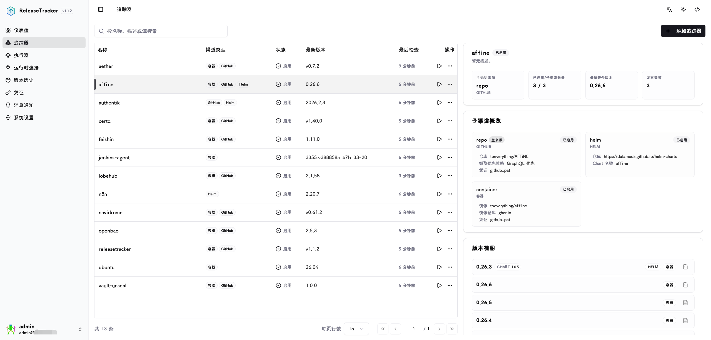

# ReleaseTracker

[中文](README.md) | [English](README.en.md) · [Wiki](https://dalamudx.github.io/ReleaseTracker/)

轻量级版本追踪与更新编排工具：追踪 GitHub、GitLab、Gitea、Helm Chart 和 OCI 镜像版本，并将选定版本应用到受支持的 Docker、Podman、Portainer、Kubernetes 和 Helm 目标。


## 功能特性

- 聚合多个版本来源，通过发布渠道和规则筛选版本，保留版本历史与发布说明。
- 绑定运行时目标，按手动、立即或维护窗口策略更新，并记录执行诊断。
- 对支持的目标提供配置快照、更新后健康检查和手动回滚。
- Webhook 事件通知、单一管理员与显式 OIDC 绑定、加密凭证和密钥轮换。
- React Web UI，支持中英文、深色模式和浏览器内配置。

各运行时能力不同，详见 [Wiki 支持矩阵](https://dalamudx.github.io/ReleaseTracker/reference/support/)。更新失败不会自动回滚，执行器快照不是应用数据备份。

## 功能截图



更多界面见 [FEATURES.md](FEATURES.md)。截图册展示界面，操作说明统一维护在 Wiki。

## 快速开始

生产环境推荐 Docker / Docker Compose。安装命令、持久化要求和首次登录步骤见 [安装与首次运行](https://dalamudx.github.io/ReleaseTracker/getting-started/installation/)。

| 任务 | 文档 |
| --- | --- |
| 配置来源、版本规则与 Changelog | [追踪器](https://dalamudx.github.io/ReleaseTracker/guides/trackers/) |
| 接入容器平台并更新服务 | [运行时连接](https://dalamudx.github.io/ReleaseTracker/guides/runtime-connections/) · [执行器](https://dalamudx.github.io/ReleaseTracker/guides/executors/) |
| 配置代理或 SSO | [反向代理](https://dalamudx.github.io/ReleaseTracker/operations/reverse-proxy/) · [管理员与 OIDC](https://dalamudx.github.io/ReleaseTracker/operations/accounts-and-oidc/) |
| 备份、升级或恢复 | [运维指南](https://dalamudx.github.io/ReleaseTracker/operations/backup-and-upgrade/) · [故障排查](https://dalamudx.github.io/ReleaseTracker/reference/troubleshooting/) |

## 架构概览

生产环境由一个 FastAPI 进程托管前端静态资源、API 和调度器，使用 SQLite 保存配置与运行记录，`system-secrets.json` 保存系统密钥。版本源 API 与运行时控制面是外部依赖。按单实例部署。

## 开发命令

需要 Python 3.12+、Node.js 20+、uv 和 npm：

```bash
git clone https://github.com/dalamudx/ReleaseTracker.git
cd ReleaseTracker
make install
make dev
```

访问前端 `http://localhost:5173`；API 与 Swagger 在 `http://localhost:8000` 和 `/docs`。Vite 将开发请求代理到后端。

```bash
uv --directory backend run pytest -q
npm --prefix frontend run test
make lint
make build
```

数据库迁移使用 `make dbmate-migrate`；`make version VERSION=x.y.z` 同步版本元数据和后端锁文件。完整命令见 `make help`。

### 文档维护

每个主题同时维护中文 `.md` 与英文 `.en.md`，新增页面同步加入 `mkdocs.yml`。一个事实只维护一个主要位置；保留旧页锚点，截图只解释难以用文字表达的操作。

```bash
python -m pip install -r docs-requirements.txt
python -m unittest discover -s scripts/tests -p 'test_check_docs.py'
mkdocs build --strict --site-dir site
python scripts/check_docs.py --site-dir site
```

文档检查覆盖双语配对、导航、内部链接、图片和旧锚点。产品行为变更还需核对支持矩阵和操作示例，不能只依赖构建通过。依赖审计、SBOM 与发布步骤以 [CI](.github/workflows/ci.yml) 和 [发布工作流](.github/workflows/release.yml) 为准。

## 路线图

- 更多通知渠道。
- 后续能力以 release notes 和 Wiki 支持范围为准。

## 特别感谢

[](https://linux.do)

## 许可证

GPL-3.0 License
