# 使用配置说明

本页说明 ReleaseTracker 的配置过程和注意事项。

## 1. 登录系统

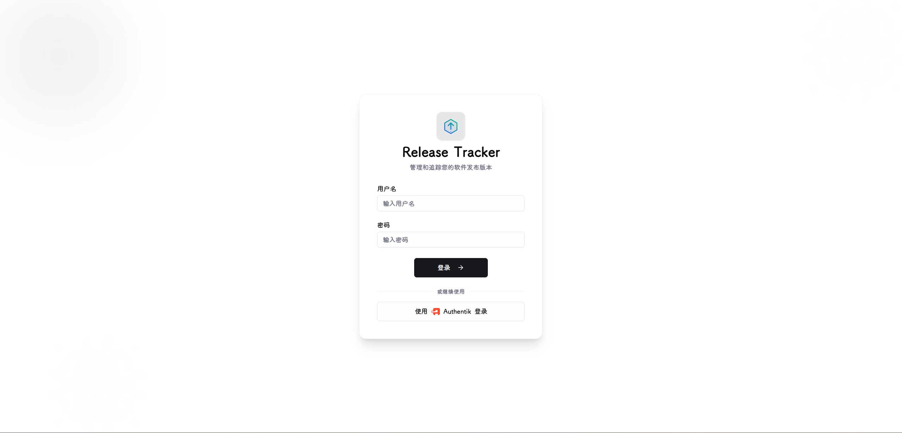

使用默认用户名`admin`密码`admin`登录到系统

!!! danger "请立即修改默认密码"
    登录后第一时间修改密码：打开**左下角用户菜单 → 用户设置 → 修改密码**。如果使用默认凭证将实例暴露在公网，任何人都可直接接管。

## 2. 系统配置

### 全局配置

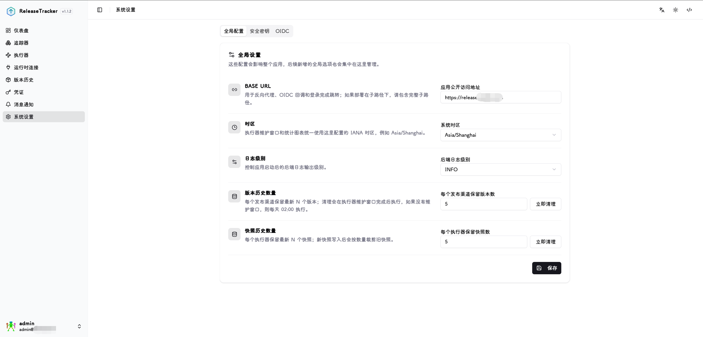

`Base URL` : 实例的对外访问地址，用于消息通知中的链接跳转以及 OIDC 回调地址，必须与实际访问 URL 保持一致

`时区` : 影响版本历史的日期分组显示以及执行器维护窗口的调度时间

`日志级别` : 控制后端日志的输出详细程度，可选 `info`、`warning`、`error`、`debug`

`版本历史数量` : 每个来源和发布渠道保留的历史版本条数，发现新版本后超出数量的旧条目将被自动清理

`快照历史数量` : 每个执行器保留的快照数量，捕获新的更新前快照后超出数量的旧快照将被自动清理

### 安全密钥

`会话密钥`: 用于 JWT 会话签名，轮换后所有已登录用户将被强制退出，需重新登录

`加密密钥`: 用于凭证和密钥数据的 Fernet 加密存储，轮换时系统会对所有已存储的加密数据进行重新加密，操作不可逆，请在轮换前确认备份

用于数据加密和用户会话加密

### OIDC

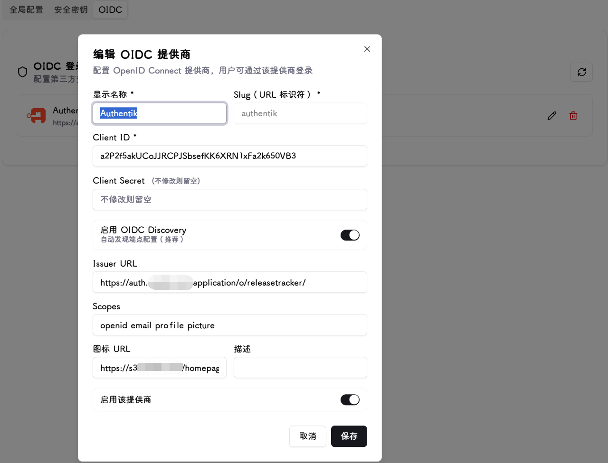

用于与企业或个人 SSO 提供商进行集成，方便统一身份认证登录。目前最多支持配置一个 OIDC 提供商。

**基础字段**

`显示名称` : 在登录页面按钮上显示的提供商名称，例如 `Authentik`

`Slug` : URL 标识符，创建后不可修改，用于构成 OIDC 回调地址，只允许小写字母、数字和连字符

`Client ID` : 在 OIDC 提供商处注册应用后获得的客户端 ID

`Client Secret` : 对应的客户端密钥，编辑时留空则保持原值不变

**端点配置**

`启用 OIDC Discovery` : 开启后只需填写 Issuer URL，系统会自动发现授权、令牌和用户信息端点（推荐）

`Issuer URL` : 启用 Discovery 时填写，例如 `https://your-idp.example.com`

`Authorization URL` : 关闭 Discovery 时手动填写授权端点地址

`Token URL` : 关闭 Discovery 时手动填写令牌端点地址

`Userinfo URL` : 关闭 Discovery 时手动填写用户信息端点地址

**其他字段**

`Scopes` : 请求的权限范围，默认为 `openid email profile`。如果提供商支持头像字段（如 `picture`），可在此追加对应 scope 以在登录时同步用户头像

`图标 URL` : 登录页面按钮上显示的提供商图标地址，留空则显示首字母缩写

`描述` : 可选的备注说明

`启用该提供商` : 关闭后该提供商不会出现在登录页面

## 3. 消息通知

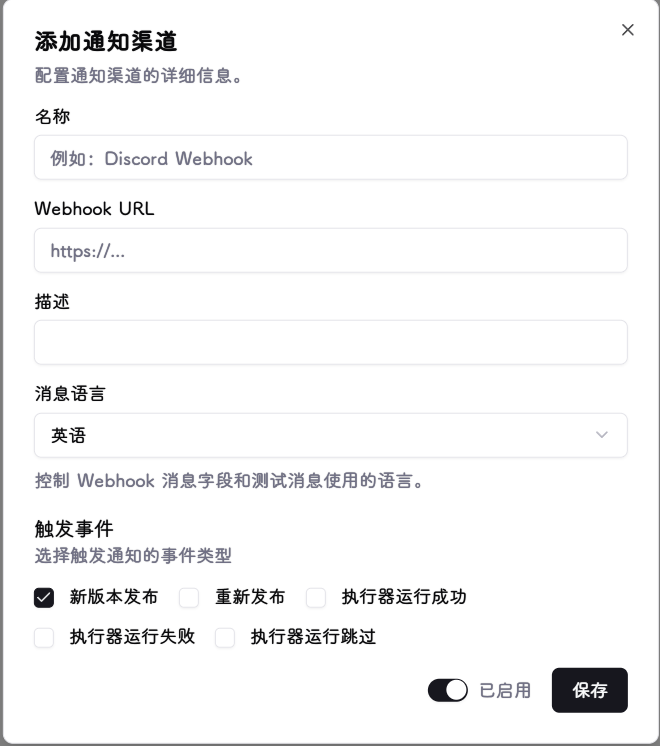

目前仅支持 Webhook 类型，兼容 Discord、Slack 及任何接受 JSON POST 请求的服务。

**通知配置字段**

`名称` : 通知器的显示名称，便于区分多个通知目标

`Webhook URL` : 接收通知的目标地址，系统会向该地址发送 HTTP POST 请求，请求体为 JSON 格式

`描述` : 可选的备注说明

`消息语言` : 通知消息的输出语言，可选`中文`或`英语`

`触发事件` : 勾选需要触发通知的事件类型，支持多选：
- **新版本**：追踪到新的版本发布时触发
- **重新发布**：相同版本标签下重新发布了新内容时触发（例如同一 tag 的两次发布 commit hash 不同）
- **执行器运行成功**：执行器完成版本更新后触发
- **执行器运行失败**：执行器更新失败时触发
- **执行器运行跳过**：执行器因策略或条件未满足而跳过本次运行时触发

`启用` : 关闭后该通知器不会发送任何消息，配置保留

配置完成后可通过操作菜单中的**测试发送**按钮向目标地址发送一条测试消息，验证连通性。

## 4. 凭证

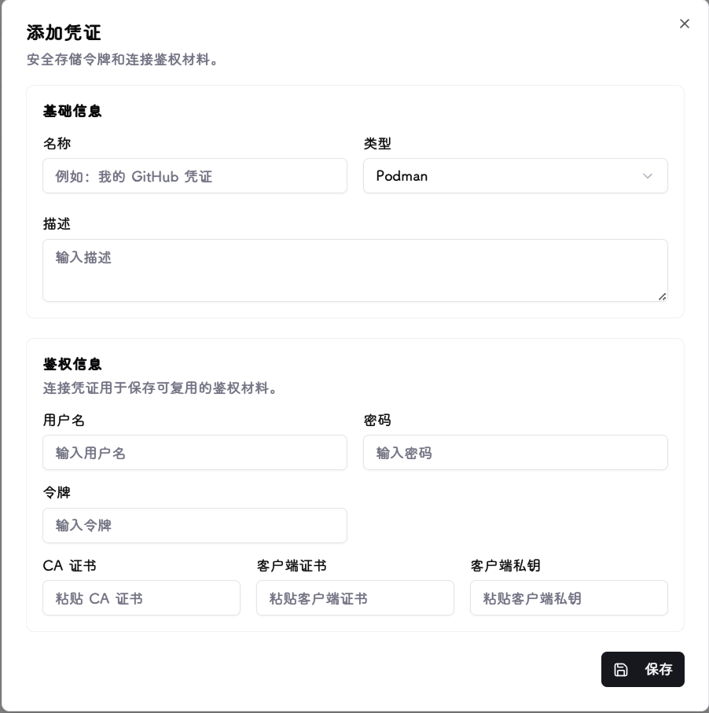

凭证用于保存访问各类平台所需的鉴权材料，所有数据经统一加密模块加密后存储在本地数据库中。

**支持的凭证类型**

| 类型 | 用途 |
|---|---|
| GitHub | GitHub 个人访问令牌（PAT），用于 GitHub 追踪器来源，填写 `ghp_` 开头的令牌 |
| GitLab | GitLab 个人访问令牌，用于 GitLab 追踪器来源，填写 `glpat-` 开头的令牌 |
| Gitea | Gitea 应用令牌，用于 Gitea 追踪器来源 |
| Helm Chart 仓库 | Helm 仓库的 Basic Auth 凭证，格式为 `username:password` |
| 容器镜像仓库 | 容器镜像仓库的用户名和密码/PAT，用于需要认证的私有镜像仓库追踪 |
| Docker | Docker 运行时连接的可选 TLS 证书（CA 证书、客户端证书、客户端私钥）及用户名密码 |
| Podman | Podman 运行时连接的可选 TLS 证书及用户名密码，与 Docker 类型相同 |
| Kubernetes | Kubernetes 运行时连接的鉴权材料，支持 kubeconfig 文件、Bearer Token、客户端证书/私钥、CA 证书 |
| Portainer | Portainer API 密钥，用于 Portainer 运行时连接 |

## 5. 运行时连接

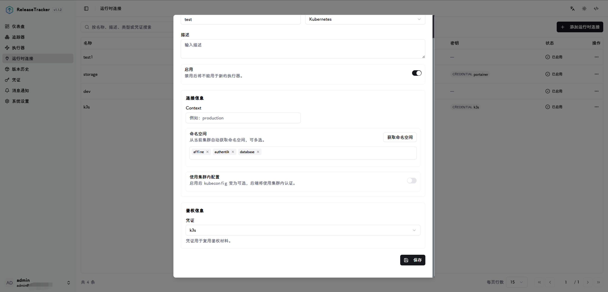

运行时连接用于对接实际运行容器或服务的基础设施，不同类型所需配置各不相同：

- **Docker / Podman**：填写 Socket 路径（如 `/var/run/docker.sock`）或 TCP 地址（如 `tcp://host:2375`），系统通过该地址与容器引擎通信
- **Kubernetes**：上传或粘贴 kubeconfig 文件内容，或在集群内部署时选择 in-cluster 模式，系统将使用对应的凭证访问集群 API
- **Portainer**：填写 Portainer 实例地址和 API Token，连接后可选择目标 Endpoint，系统通过 Portainer API 管理其下的容器和 Stack

**通用字段**

`名称` : 连接的显示名称

`类型` : 选择 Docker、Podman、Kubernetes 或 Portainer

`描述` : 可选备注

`启用` : 关闭后该连接不参与执行器目标发现

**Docker / Podman 专属字段**

`Socket / 主机地址` : Unix Socket 路径或 TCP 地址，例如 `/var/run/docker.sock` 或 `tcp://192.168.1.10:2375`

`API 版本` : 可选，留空则自动协商

`TLS 验证` : 启用后要求服务端提供有效 TLS 证书，配合凭证中的 CA 证书使用

`凭证` : 可选，选择包含 TLS 证书或用户名密码的 Docker/Podman 类型凭证

**Kubernetes 专属字段**

`In-Cluster 模式` : 在 Kubernetes 集群内部署 ReleaseTracker 时启用，自动使用 ServiceAccount 凭证

`凭证` : 选择包含 kubeconfig 或 Token/证书的 Kubernetes 类型凭证（In-Cluster 模式下不需要）

`命名空间` : 可选，限定目标发现的命名空间范围，支持多选；留空则发现所有可访问的命名空间

**Portainer 专属字段**

`实例地址` : Portainer 的访问地址，例如 `https://portainer.example.com`

`Endpoint ID` : Portainer 中目标环境的 ID

`凭证` : 选择包含 API 密钥的 Portainer 类型凭证

## 6. 追踪器

### 添加追踪器

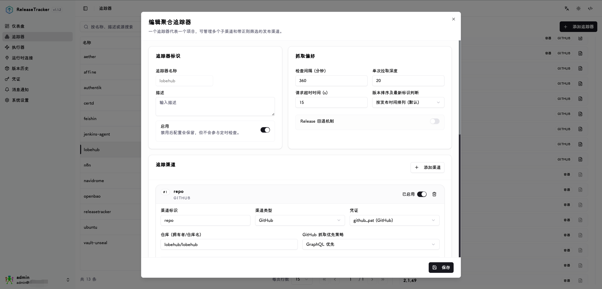

#### 追踪器标识

`追踪器名称` : 追踪器的唯一标识符，创建后不可修改

`描述` : 可选备注

`启用` : 关闭后配置保留，但不参与定时检查

#### 追踪渠道

每个追踪器可以包含一个或多个追踪渠道，每个渠道对应一个上游来源。

`渠道标识` : 渠道的唯一标识符，例如 `upstream-release`

`渠道类型` : 选择来源平台类型，支持以下类型：

- **GitHub**：需填写`仓库 (拥有者/仓库名)`，例如 `kubernetes/kubernetes`；可选填写`GitHub 抓取优先策略`
- **GitLab**：需填写`项目 ID/路径`（例如 `group/project`）和`实例 URL`（自托管实例填写，公共 GitLab 留空）
- **Gitea**：需填写`仓库路径 (拥有者/仓库名)`和`实例 URL`
- **Helm Chart**：需填写`Chart 名称`（例如 `nginx`）和`Chart 仓库 URL`（例如 `https://charts.bitnami.com/bitnami`）
- **容器镜像仓库**：需填写`镜像名`（例如 `example/app`）和`Registry 地址`（例如 `ghcr.io`）；可选配置`发布时间来源`

`凭证` : 可选，选择对应类型的凭证用于私有仓库或需要认证的来源

`GitHub 抓取优先策略`：仅 GitHub 类型可见。GraphQL 优先模式需要配置个人 PAT 凭证，数据更准确，推荐使用；REST 优先模式无需凭证，但对迭代频繁的项目可能抓取不到期望版本，需要增大`单次拉取深度`来补偿。

`发布时间来源`：仅容器镜像仓库类型可见，控制镜像版本的发布时间如何确定：
- **自动**：按仓库类型自动识别
- **总是尝试读取真实构建时间**：从镜像配置中读取实际构建时间
- **仅使用首次观察时间**：使用系统首次发现该镜像标签的时间

#### 发布渠道

每个追踪渠道可以配置一个或多个发布渠道，用于通过正则表达式对版本进行分类筛选。

`发布渠道类型` : 选择渠道分类，可选 `stable`（稳定版）、`prerelease`（预发布版）、`beta`（测试版）、`canary`（金丝雀版）

`发布类型` : 仅 GitHub、GitLab、Gitea 类型可见，按上游发布状态过滤：`发布版`（Release）或`预发布版`（Pre-Release）

`包含正则` : 只有匹配该正则的版本才会进入当前发布渠道，留空则包含所有版本

`排除正则` : 即使包含正则命中，只要匹配该正则也会被排除，留空则不排除任何版本

#### 抓取偏好

`检查间隔 (分钟)` : 定时检查版本更新的间隔时间，默认 360 分钟

`单次拉取深度` : 每次检查时从上游拉取的最大版本条数，默认 10 条。对于迭代频繁的项目，可适当增大以避免漏抓（最大 100 条）

`请求超时时间 (s)` : 单次网络请求的最大等待秒数，默认 15 秒，源站较慢时可增大（最大 180 秒）

`版本排序及最新标识判断` : 控制如何确定"最新版本"：
- **按发布时间排列（默认）**：以上游发布时间为准
- **按语义化排列**：按 SemVer 规则排序，适合有旧版安全补丁的项目，但会忽略旧版本线上的补丁更新

`Release 回退机制`：适用于只打 tag 但不发布任何 Release 版本的项目。启用后，当上游没有返回 Release 时，系统会回退为拉取原始 Git Tag

#### 发布说明

`发布说明来源`：目前支持两种源作为发布说明的内容：

- **使用 Release Notes**：使用上游 Release 版本自带的发布说明（默认）
- **使用自定义 Changelog**：从仓库中的 changelog 文件提取发布说明，需要追踪器包含至少一个 GitHub、GitLab 或 Gitea 来源

选择**使用自定义 Changelog** 后，会出现以下配置项：

`Changelog 仓库来源` : 当追踪器有多个仓库来源时，选择用于读取 changelog 文件的来源

`Changelog 路径模板` : changelog 文件在仓库中的路径，支持占位符 `{tag}`、`{version}`、`{major}`、`{minor}`、`{patch}`。例如：
- 单文件：`CHANGELOG.md`
- 按版本分文件：`docs/releases/{version}.md`
- Kubernetes 风格：`CHANGELOG/CHANGELOG-{major}.{minor}.md`

`文件引用` : 读取 changelog 文件时使用的 Git 引用：
- **默认分支**：始终读取仓库默认分支上的最新文件
- **发布标签**：读取对应发布标签时的文件快照
- **指定引用**：使用下方填写的固定引用（分支名、tag 或 commit SHA）

`指定引用` : 仅在文件引用选择"指定引用"时显示，填写具体的分支名、tag 或 commit SHA，例如 `main`

`提取方式` : 控制如何从文件中提取当前版本的内容：
- **整个文件**：使用文件全部内容，适合每个版本独立一个文件的场景
- **匹配版本段落**：在文件中查找与当前版本匹配的标题，提取该段落内容，适合单文件多版本的 changelog
- **从匹配段落的子标题开始**：在匹配的版本段落内，从指定子标题处开始提取，适合 Kubernetes 风格的 changelog

`版本标题模板` : 可选，指定版本标题的匹配模式，支持 `{tag}`、`{version}` 等占位符，例如 `# {tag}`。留空时会自动匹配常见格式，如 `## [1.2.3]`、`## 1.2.3`、`# v1.2.3`

`起始子标题` : 仅在提取方式选择"从匹配段落的子标题开始"时显示，填写子标题的前缀文本，例如 `Changelog since`

一般情况下如果 Release 版本包含发布说明则使用默认`release note`方式，如果不包含，比如是这样：
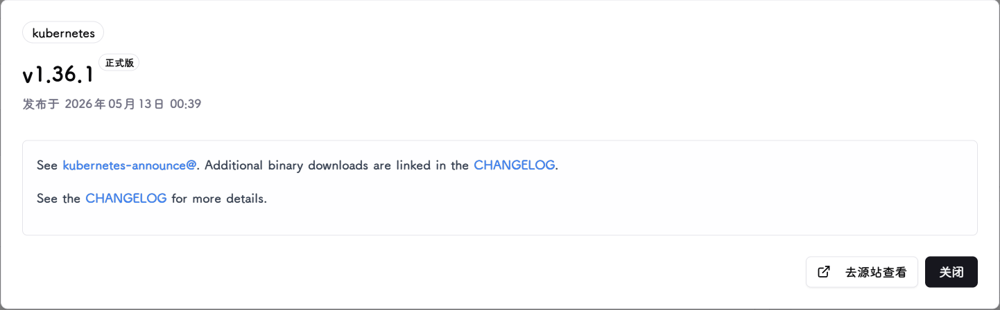
则使用`changelog`模式，当仓库中有相关 CHANGELOG 文件作为版本发布说明记录，做下相关配置即可

最终效果如下：
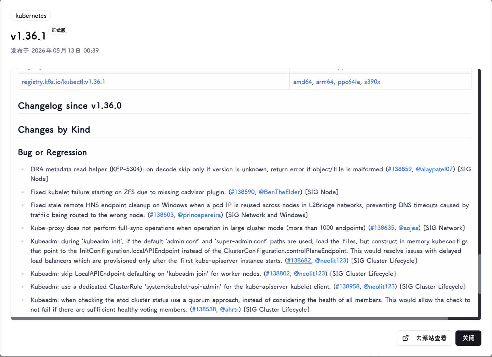

完成添加追踪器后，可以手动检查版本更新，来验证版本筛选正则表达式和期望版本是否符合预期，因为该版本数据会直接参与容器镜像版本更新，所以一定要准确。

## 7. 执行器

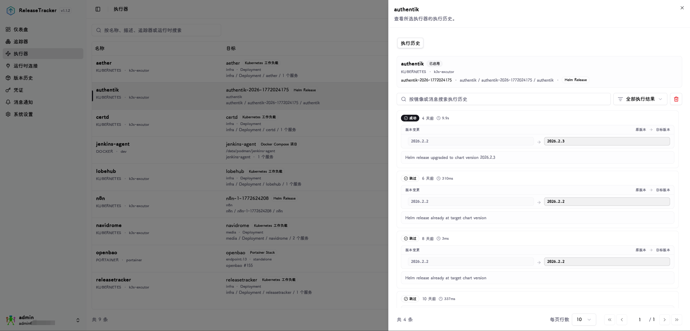

### 目标发现

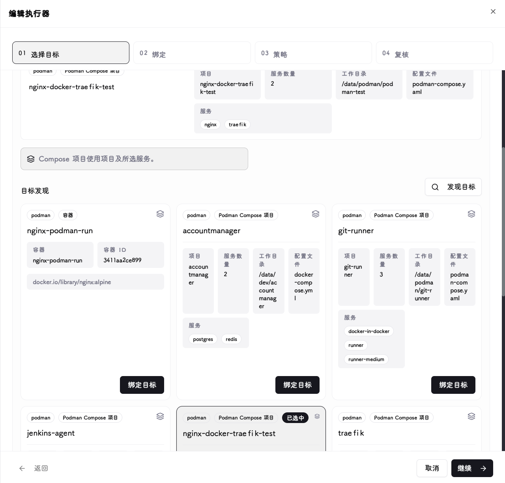

选择已配置的运行时连接后，系统会自动扫描该连接下所有可管理的容器、服务、Stack 或工作负载，列出可供绑定的目标列表。

### 绑定

将追踪器的版本来源与发现的运行时目标关联起来，指定哪个追踪器的哪个发布渠道负责驱动哪个容器或服务的镜像更新。

对于 Docker Compose、Portainer Stack 和 Kubernetes 工作负载等多服务目标，可以为每个服务单独配置绑定关系。

### 策略

配置版本更新的触发方式：**手动**模式需在界面上主动触发；**立即**模式在检测到新版本后自动执行；**维护窗口**模式仅在指定的时间段内自动执行，适合对更新时机有要求的生产环境。

**维护窗口字段**（仅在选择维护窗口模式时显示）

`维护日期` : 选择允许执行更新的星期几，可多选

`开始时间` / `结束时间` : 维护窗口的起止时间，时间以系统配置的时区为准

**镜像策略字段**（Helm 目标不适用）

`镜像选择策略` : 控制更新时如何确定目标镜像：
- **替换当前镜像的 Tag**：保留容器当前使用的镜像名，只替换版本 tag
- **使用追踪器镜像和 Tag**：使用追踪器来源中配置的镜像名和版本 tag

`镜像引用方式` : 控制更新时使用 tag 还是 digest 引用镜像：
- **Digest**：使用镜像摘要，确保精确锁定到特定构建
- **Tag**：使用版本标签

#### 健康检查

更新完成后，执行器可以对目标服务进行健康检查，验证服务是否正常启动，再将本次运行标记为成功。

`策略` : 选择健康检查方式：
- **自动（推荐）**：根据运行时类型自动选择合适的检查方式
- **运行时原生就绪**：使用容器引擎或 Kubernetes 原生的健康状态判断
- **手动 HTTP 探针**：从 ReleaseTracker 后端向指定地址发送 HTTP 请求
- **手动 TCP 探针**：从 ReleaseTracker 后端向指定地址建立 TCP 连接
- **Helm 发布状态**：仅 Helm 目标可用，检查 Helm Release 的部署状态
- **关闭**：不执行健康检查，更新完成即标记成功

`失败时` : 健康检查未通过时的处理方式：
- **标记为失败**：将本次执行器运行标记为失败状态
- **标记为降级**：将本次执行器运行标记为降级状态（更新已完成但健康检查未通过）

**HTTP 探针字段**（仅手动 HTTP 探针时显示）

`主机` : 探针请求的目标主机，例如 `127.0.0.1`

`端口` : 目标端口，例如 `8080`

`路径` : HTTP 请求路径，必须以 `/` 开头，例如 `/health`

`协议` : 选择 `http` 或 `https`

`方法` : 选择 `GET` 或 `HEAD`

`期望状态码` : 用英文逗号分隔的期望 HTTP 状态码，例如 `200,204`；留空则接受任意 2xx/3xx 响应

**TCP 探针字段**（仅手动 TCP 探针时显示）

`主机` : 探针连接的目标主机

`端口` : 目标端口

**时序字段**（策略不为"关闭"时显示）

`等待期（秒）` : 更新完成后等待多少秒再开始探测，给服务留出启动时间

`单次超时（秒）` : 单次探测请求的最大等待时间

`探测间隔（秒）` : 两次探测之间的间隔时间

`总探测时长（秒）` : 等待期结束后，最多持续探测多少秒

### 复核

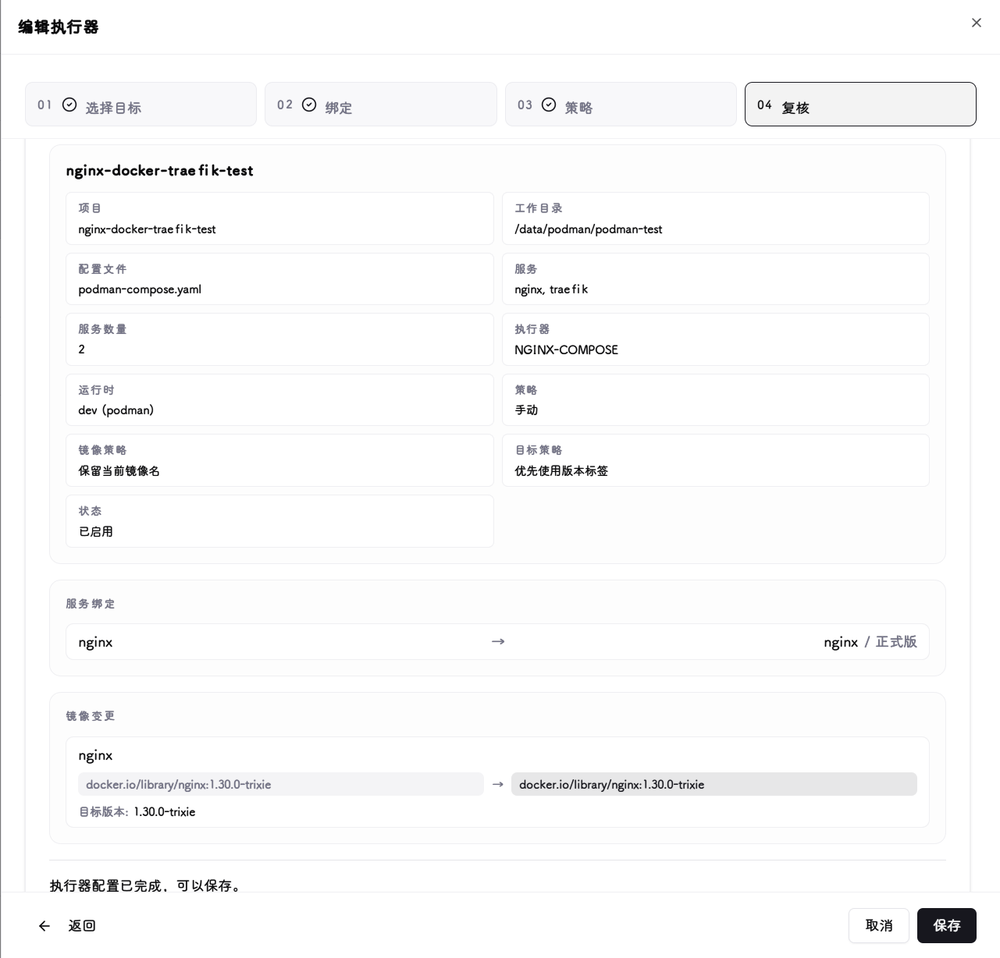

查看目标版本是否符合预期后保存，可使用立即执行测试版本更新是否符合预期。

### 快照

由于 Docker、Podman、Compose 容器组的版本更新是破坏性的操作（删除容器 → 更新镜像 → 启动新容器），目前做不到 100% 还原所有配置，为了以防配置丢失，更新前会从接口获取完整的运行状态下的配置并作为快照保存，在更新出错时可使用快照回滚功能尝试版本回滚，但要注意具体应用是否支持回退。

!!! note "快照与回滚的适用范围"
    快照和回滚功能仅适用于 Docker、Podman 和 Docker Compose 目标。Portainer Stack、Kubernetes 工作负载和 Helm Release 目标采用声明式管理，不需要也不支持快照/回滚操作。
