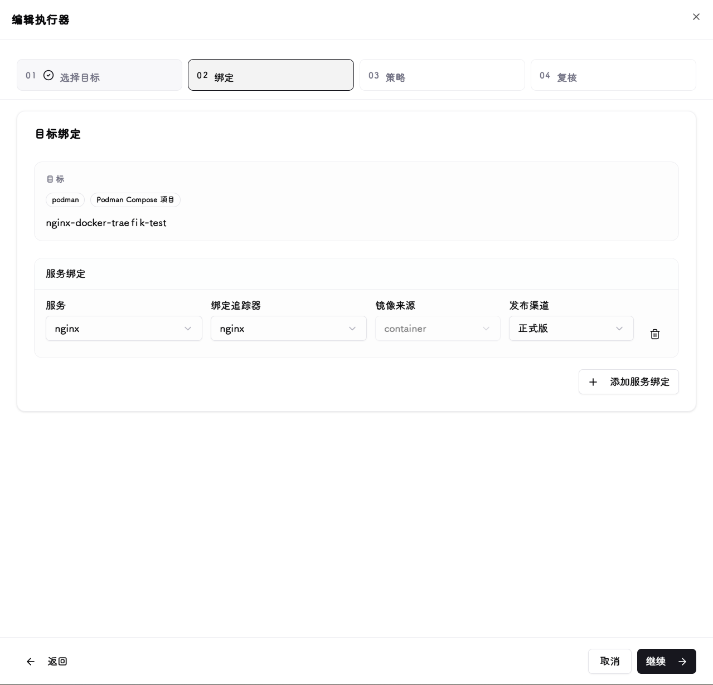

# 执行器与更新策略

执行器把来源的发布渠道绑定到实际服务。创建前先确认[版本筛选](trackers.md#verify)和[运行时连接](runtime-connections.md#verify)正确，并检查目标的[支持范围](../reference/support.md#runtimes)。

## 创建与绑定 {#bindings}

1. 新建执行器，选择运行时连接并发现目标。
2. 为目标绑定具体的追踪器来源和发布渠道。
3. 多服务目标逐项核对服务绑定，不要把不同服务误指向同一个镜像来源。
4. 首次选择手动模式，复核目标镜像或 Chart 版本后保存。

## 触发方式 {#policies}

| 模式 | 何时执行 |
| --- | --- |
| 手动 | 操作员在界面触发 |
| 立即 | 发现新的目标版本后自动执行 |
| 维护窗口 | 仅在允许的星期和时段内自动执行，按系统时区解释 |

维护窗口不是固定版本发布计划。没有符合规则的目标版本、配置停用或已是目标版本时，运行可能被跳过。手动运行用于主动验证，不应当作“等到维护窗口才执行”的操作。

## 镜像选择 {#images}

| 策略 | 适用情况 |
| --- | --- |
| 替换当前镜像的 Tag | 保留当前镜像仓库，只使用来源提供的版本标签 |
| 使用追踪器镜像和 Tag | 目标应使用 OCI 来源中配置的镜像仓库 |
| Digest 引用 | 需要锁定到具体构建，且来源提供可用摘要 |
| Tag 引用 | 使用版本标签；同一标签可能被上游重新发布 |

这些镜像字段不适用于 Helm Release；Helm 更新选择 Chart 版本。不要把同名 Git Tag 直接视作一定存在的镜像 Tag，先核对仓库和构建发布规则。

## 验证一次更新 {#verify}

运行前确认目标版本、镜像策略和服务绑定。运行后查看执行历史中的状态、目标版本和每个服务的诊断，再检查应用是否可用。

- 首次成功后，再按需要启用立即或维护窗口模式。
- 健康检查与手动恢复见[健康检查与回滚](health-and-rollback.md)。
- 写操作超时不代表服务未变更；先检查运行时实际状态，不要直接连续重试。见[更新超时](../reference/troubleshooting.md#update-timeout)。
