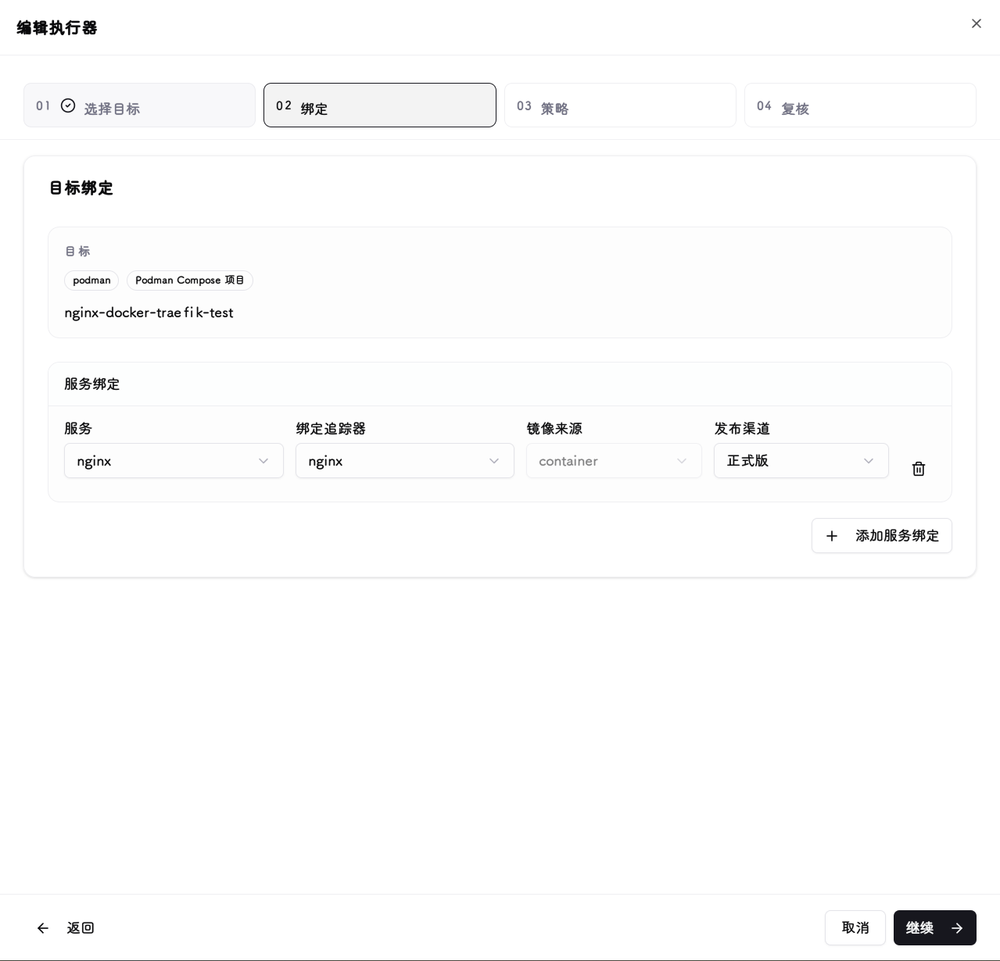

# 执行器与更新策略

执行器把来源的发布渠道绑定到实际服务。创建前先确认[版本筛选](trackers.md#verify)和[运行时连接](runtime-connections.md#verify)正确，并检查目标的[支持范围](../reference/support.md#runtimes)。

## 创建与绑定 {#bindings}

1. 新建执行器，选择运行时连接并发现目标。
2. 为目标绑定具体的追踪器来源和发布渠道；多服务目标逐项核对，不要把不同服务指向同一个镜像来源。
3. 首次使用手动模式，复核目标镜像或 Chart 版本后保存。

## SSH Compose 目标 {#ssh-compose}

选择 [SSH 主机连接](runtime-connections.md#ssh)后，可自动发现远程主机上的 Compose 项目；无法可靠发现时手动填写工作目录、Compose 文件（按加载顺序）、环境文件和 Profiles。点击 **分析** 后只读解析项目，确认 Compose 工具、服务及其版本来源。

| 版本写入方式 | 行为 |
| --- | --- |
| 修改原文件/环境变量 | 原地更新 Compose 文件或环境文件中的镜像引用 |
| 独立镜像覆盖文件 | 创建并维护 ReleaseTracker 专用的覆盖文件，不改原文件；变量来自进程环境时使用此方式 |

只修改已选择服务的镜像；镜像表达式过于复杂、变量被多处共享或只有 build 配置时拒绝执行。一个项目只能被一个执行器占用。更新前保存项目文件快照；若连接中断导致结果不确定，项目保持锁定，需在执行器中确认远端命令已停止后选择 **恢复配置文件** 或 **核验并解锁**。恢复文件不会回滚正在运行的容器。

## 触发方式 {#policies}

| 模式 | 何时执行 |
| --- | --- |
| 手动 | 操作员在界面触发 |
| 立即 | 发现新的目标版本后自动执行 |
| 维护窗口 | 仅在允许的星期和时段内自动执行，按系统时区解释 |

维护窗口只约束自动部署的首次远程写入；已开始的多步更新和就绪观察可跨窗口完成。没有符合规则的目标版本、配置停用或已是目标版本时，运行会被跳过。

## 镜像选择 {#images}

| 策略 | 适用情况 |
| --- | --- |
| 替换当前镜像的 Tag | 保留当前镜像仓库，只使用来源提供的版本标签 |
| 使用追踪器镜像和 Tag | 目标应使用 OCI 来源中配置的镜像仓库 |
| Digest 引用 | 需要锁定到具体构建，且来源提供可用摘要 |
| Tag 引用 | 使用版本标签；同一标签可能被上游重新发布 |

Helm Release 不使用这些字段，而是选择 Chart 版本。同名 Git Tag 不一定存在对应镜像 Tag，先核对仓库和构建发布规则。

## 自动升级版本限制 {#version-policy}

可选“不限版本”（默认）、“仅次版本和补丁”或“仅补丁”。后两种按稳定 SemVer 比较运行版本与目标：超出范围、降级、预发布或无法映射到版本的标签/摘要会转为[部署计划确认](#approval)，不消耗重试次数。容器按镜像 tag 判断；Helm 按 Chart 版本而非 appVersion；分组只比较已绑定的服务。SSH Compose 等无法可靠取得当前版本的路径总是需要确认。手动部署不受此限制。

## 部署计划确认 {#approval}

部署前会只读采集目标现状并生成部署计划。以下情况任务会停在 **需要确认部署计划**，并发送“需要确认部署”通知：

- 初次纳管目标，或目标缺少 ReleaseTracker 纳管标记；
- 运行配置与上次纳管基线不一致（配置漂移）；
- 目标版本超出[版本限制](#version-policy)；
- 手动更新，需要审核配置差异。

在任务详情中核对目标、运行时身份、配置指纹、恢复范围和配置差异（敏感值隐藏），再点击 **确认并继续部署**。确认有有效期，并绑定当前证据；执行前配置变化需要 **刷新计划** 重新确认。配置差异未完整显示时不能确认。

目标已被其他实例或执行器纳管、纳管标记冲突或版本不受支持时，部署直接 **阻断**，不能通过确认绕过，需要先处理归属。

## 验证一次更新 {#verify}

运行前确认目标版本、镜像策略和服务绑定。运行后在执行历史和 **任务队列** 中查看状态、目标版本和每个服务的诊断，再检查应用是否可用。

- 首次成功后，再按需要启用立即或维护窗口模式。
- 任务显示“执行状态待确认”时，先在运行时核实实际状态再解除阻塞。
- 写操作超时不代表服务未变更，见[更新超时](../reference/troubleshooting.md#update-timeout)；健康检查与恢复见[健康检查与回滚](health-and-rollback.md)。
