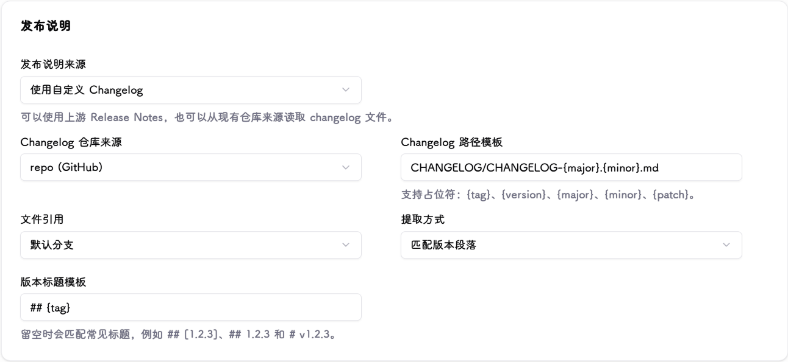

# Trackers and version rules

Trackers discover and filter versions; they do not modify services. Runtime updates require an [executor](executors.md).

## Add version sources {#sources}

Under **Trackers → Add**, choose an immutable tracker name and add one or more sources. The UI's “tracking channel” means a version source, not the release channel described below.

| Source | Required information | Notes |
| --- | --- | --- |
| GitHub | `owner/repo` | Start with REST-first without credentials; GraphQL-first requires a PAT |
| GitLab | Project ID or `group/project` | Set the instance URL for self-hosted GitLab |
| Gitea | `owner/repo`, instance URL | Private repositories require a token |
| Helm chart | Chart name, repository URL | Private repositories can use Basic Auth |
| OCI image | Image name, registry address | Private registries require matching credentials |

See [Credentials and runtimes](runtime-connections.md#credentials) for authentication and HTTPS requirements. A tracker can contain both GitHub releases and OCI images; an executor binds to a specific source, not just a project name.

## Filter release channels {#channels}

Each source can configure `stable`, `prerelease`, `beta`, and `canary` channels. A channel name is separate from the upstream Release / Pre-Release status; do not infer filtering behavior from its name alone.

| Setting | Rule |
| --- | --- |
| Release type | GitHub / GitLab / Gitea can filter Release or Pre-Release |
| Include pattern | Keep matching version tags; blank means unrestricted |
| Exclude pattern | Remove matches after inclusion; exclusion takes precedence |

For example, `^v?1\.2\.\d+$` selects three-part versions on the `1.2.x` line. Run a manual check and verify the tags before binding this channel to an executor.

## Fetching and latest detection {#fetching}

| Setting | Selection guidance |
| --- | --- |
| Check interval | Default 360 minutes; shorter intervals increase upstream requests |
| Fetch depth | Default 10 entries; increase for frequently updated projects |
| Request timeout | Default 15 seconds; applies to source fetching, not runtime updates |
| Publish-time sorting | Follows recent releases, including new patches on older release lines |
| SemVer sorting | Follows the highest semantic version; patches on older lines do not become the highest version |
| Release fallback | Can fetch raw Git tags when upstream returns no releases |

Container publish-time strategies include automatic, image build time, and first observed time. First observed time is not the upstream publication time and cannot reconstruct the exact historical release order.

## Custom changelog {#changelog}

Keep Release Notes when upstream already supplies them. Use a custom changelog only when notes live in a repository file; the tracker must include a GitHub, GitLab, or Gitea source.

| File layout | Path template | Extraction mode |
| --- | --- | --- |
| One file, multiple versions | `CHANGELOG.md` | Matched version section |
| One file per version | `docs/releases/{version}.md` | Entire file |
| Kubernetes-style | `CHANGELOG/CHANGELOG-{major}.{minor}.md` | From subheading in matched section |

Paths support `{tag}`, `{version}`, `{major}`, `{minor}`, and `{patch}`. Read from the default branch, release tag, or a specified branch / tag / commit. Leave the heading template blank for automatic matching; specify it if matching fails. Subheading extraction needs a prefix such as `Changelog since`.

## Verify the result {#verify}

After a manual check, inspect the version tag, source, channel, and release notes. Disabling a tracker stops scheduled checks without deleting configuration. Use [missing or unexpected versions](../reference/troubleshooting.md#versions) to troubleshoot. Fix the rules before enabling automatic execution.
